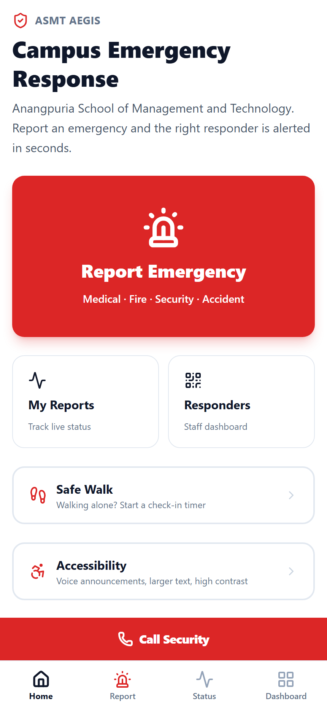
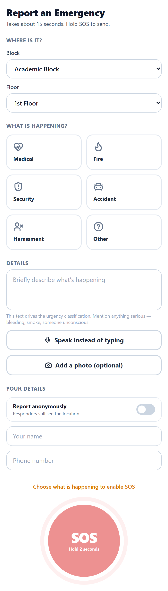
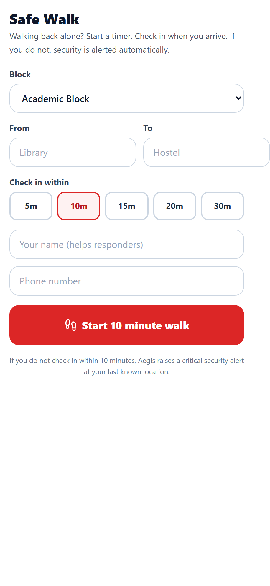
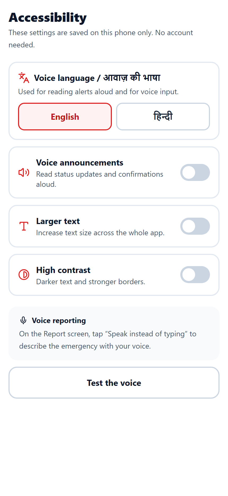
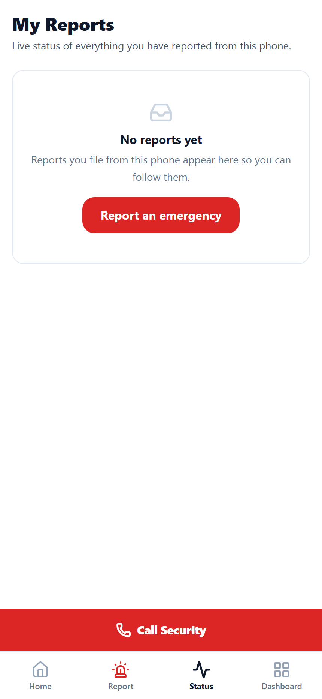
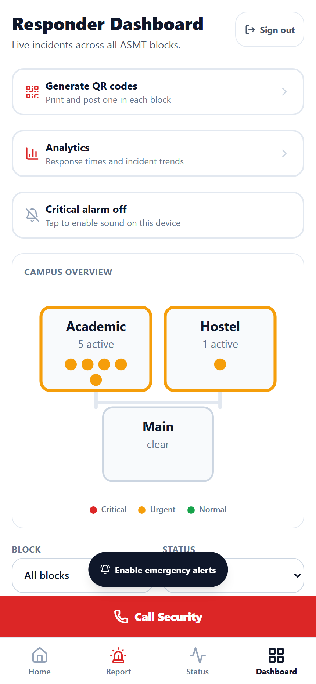
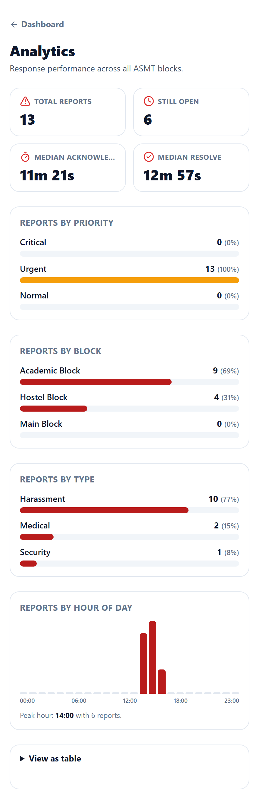
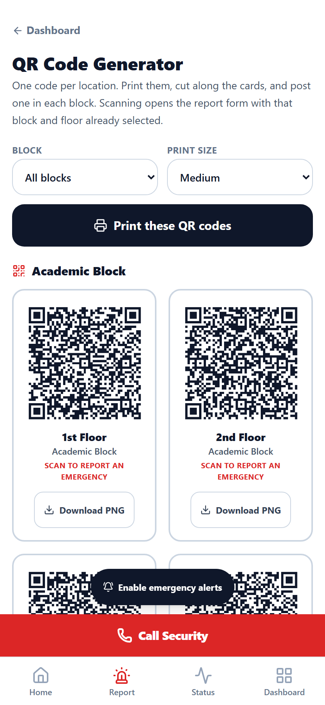

# ASMT Aegis — Campus Emergency Response System

A phone-first emergency reporting system for a three-block college campus: scan a QR code, hold one button, and the right responder is paged in seconds with the urgency already judged.

**Live:** https://asmt-aegis.vercel.app
**Event:** A.S.M.T. Hackathon 2K26 · Team **Bhand Coders🍁**
**Institution:** Anangpuria School of Management and Technology

---

## Problem Statement

Anangpuria School of Management and Technology operates across three blocks — Main, Academic and Hostel. When something goes wrong today, the process breaks down in five specific ways:

1. **Nobody knows the number.** A student in an emergency opens their contacts and hunts for a warden's number they never saved.
2. **The message loses the details.** A phone call leaves no record of which block, which floor, or what was said.
3. **Everything looks equally urgent.** A sprained ankle and someone who has stopped breathing arrive on the same WhatsApp group, in the same font.
4. **Nobody owns it.** If the first person contacted is teaching, in a meeting or asleep, nothing escalates — the report just sits there.
5. **The reporter is left blind.** They cannot tell whether help is coming, so they call again and again.

The gap this project targets is between *something has happened* and *the right person knows, and has confirmed they are coming.*

## Solution

Aegis is an installable web app (PWA) that removes every avoidable step between an emergency and a responder:

- QR codes posted in each block open a report form with the **location already filled in**.
- The student picks an emergency type and holds one button for two seconds.
- The urgency is classified automatically by a **deterministic rule engine plus an optional AI second opinion**, and the more severe verdict wins.
- The on-duty responder for that block and role is paged on **Telegram**.
- If nobody acknowledges within a deadline, the report **escalates to the next tier automatically**.
- The reporter watches the whole thing happen live and sees an ETA once a responder accepts.

## Key Features

Only features actually implemented in this repository are listed.

**Reporting**
- QR deep links that pre-fill block and floor (`/report?campus=<id>&location=<id>`)
- Six emergency types: Medical, Fire, Security, Accident, Harassment, Other
- Hold-to-confirm SOS button (2 seconds) with an animated progress ring
- Anonymous reporting toggle — responders still receive the exact location
- Optional photo evidence, downscaled to 1280px in the browser before upload
- Voice dictation for the description (where the browser supports speech recognition)
- Best-effort geolocation that never blocks submission
- "Cancel — false alarm" window after submitting

**Classification and alerting**
- Two-stage classification: rule engine always runs, AI adds a second opinion under a 4-second timeout
- English, Hindi (Devanagari) and romanised Hinglish keyword matching
- Telegram alerts routed by campus and responder role, with priority indicator and a deep link
- Three-tier auto-escalation (medical/security → security/warden → warden/admin)
- Duplicate grouping: the same emergency type in the same block within 10 minutes attaches to the original instead of paging again

**Live tracking**
- Supabase Realtime status page for the reporter, with a full event timeline
- Responder ETA calculated from the responder's position when they acknowledge
- Resync-on-reconnect plus polling fallback, so the UI never silently goes stale

**Responder tools**
- Live incident dashboard sorted by priority then waiting time
- Looping audio alarm for unacknowledged critical or overdue incidents
- Acknowledge / Resolve actions, executed server-side
- Station-wide alert that interrupts a signed-in responder on any screen
- Campus schematic showing all three blocks with live incident markers
- QR code generator with print layout and per-location PNG download
- Analytics: median acknowledge/resolve time, breakdowns by priority, block, type and hour

**Safety and accessibility**
- Safe Walk: a check-in timer whose expiry raises a critical incident automatically at the walker's last known position
- Voice announcements of status changes, in English or Hindi
- Larger text and high contrast modes
- `aria-live` regions and accessible names that match visible labels
- Lighthouse accessibility score of 100 on the deployed site

**Resilience**
- Installable PWA with an offline app shell
- IndexedDB outbox — a report filed with no network sends itself when connectivity returns
- Permanent "Call Security" bar and a pre-filled emergency SMS, both of which work on cellular voice with no data

## AI Features

AI is used in exactly one place: **deciding how urgent a report is.**

**Where:** [`lib/classify.ts`](lib/classify.ts), invoked by [`app/api/classify/route.ts`](app/api/classify/route.ts).

**What it does:** the emergency type, description, location and time are sent as a single prompt. The model returns JSON: `{"priority":"critical|urgent|normal","reasoning":"one sentence"}`. The reasoning is stored on the incident and shown to the reporter and responder.

**How it is guarded — this is the important part:**

- A **deterministic rule engine runs first and always succeeds.** It scans for critical triggers (`unconscious`, `not breathing`, `bleeding heavily`, `fire`, `smoke`, `collapsed`, `weapon`, `seizure`, `chest pain`, `choking`, plus Hindi and Hinglish equivalents such as `बेहोश` / `behosh`, `आग` / `aag`, `खून` / `khoon`) and urgent triggers (`sprain`, `cut`, `dizzy`, `fever`, `बुखार` / `bukhar`, `चक्कर` / `chakkar`).
- The AI call has a **hard 4-second timeout** and never throws.
- `final_priority = MAX(rule_priority, ai_priority)` on the ordering `critical > urgent > normal`. **The AI can escalate a report but can never talk the system down from a rule-matched emergency.**
- If the AI provider is unreachable, out of credit, slow or returns unparseable output, classification continues on the rule engine alone and the alert still goes out.

**Provider:** swappable with a single environment variable, `AI_PROVIDER=openai` or `AI_PROVIDER=anthropic`.

> **Current status, stated honestly:** the deployed instance is running **rule-engine only**, because the OpenAI key available during the hackathon had no remaining credit (HTTP 429 `insufficient_quota`). The AI path is fully implemented and will activate as soon as a funded key is supplied. Classification, alerting, escalation and the dashboard all work without it — which is exactly the failure mode the design anticipates.

## User Flow

```
Student
  │  scans the QR code posted in their block  (or opens /report)
  ▼
Report form           block + floor pre-filled, emergency type, description,
  │                   optional photo / voice input, anonymous toggle
  │  holds SOS for 2 seconds
  ▼
Incident created      anonymous insert, enforced by Row Level Security
  │
  ▼
Classification        rule engine (always)  +  AI second opinion (4s timeout)
  │                   final_priority = MAX(rule, ai)
  │                   duplicate of a recent report in the same block? → grouped
  ▼
Department assignment Telegram alert to the on-duty responders for that
  │                   campus and role  (tier 1: medical + security)
  ▼
Tracking              reporter watches the live timeline over Supabase Realtime:
  │                   reported → classified → notified → acknowledged
  │
  ├── not acknowledged in time?  → tier 2 (security + warden) → tier 3 (warden + admin)
  │                                 each tier recorded and paged exactly once
  ▼
Acknowledgement       responder taps Acknowledge; their position is captured and
  │                   the reporter immediately sees a distance-based ETA
  ▼
Resolution            responder marks Resolved; the full event timeline is retained
                      and feeds the analytics screen
```

## Tech Stack

| Layer | Technology |
|---|---|
| Framework | Next.js 14 (App Router), React 18, TypeScript |
| Styling | Tailwind CSS 3 |
| Database | Supabase (PostgreSQL) with Row Level Security |
| Realtime | Supabase Realtime (Postgres change streams) |
| Auth | Supabase magic-link email + HMAC-signed staff PIN session |
| File storage | Supabase Storage (incident photos) |
| AI | OpenAI or Anthropic, selected by `AI_PROVIDER` |
| Notifications | Telegram Bot API |
| PWA | `@ducanh2912/next-pwa` (Workbox service worker) |
| QR codes | `qrcode` (server-side PNG generation) |
| Icons | `lucide-react` |
| Animation | `framer-motion` |
| Browser APIs | Web Speech, Web Audio, Geolocation, Vibration, IndexedDB |
| Hosting | Vercel |

## Architecture

**Frontend** — Next.js App Router. Public screens (`/`, `/report`, `/status`, `/safe-walk`, `/accessibility`) are statically rendered so they paint immediately; staff screens are server-rendered on demand because they read the session cookie. Client components handle realtime subscriptions, audio, speech and geolocation.

**Backend / API** — Next.js Route Handlers running on the Node.js runtime:

| Route | Purpose |
|---|---|
| `POST /api/classify` | Rule engine + AI, duplicate grouping, Telegram dispatch |
| `POST /api/report` | Server-side intake used by the offline queue |
| `POST /api/incident/action` | Acknowledge / Resolve (staff only), computes ETA |
| `POST /api/incident/cancel` | Reporter withdraws a false alarm |
| `POST /api/escalate` · `GET` (cron) | Sweeps for unacknowledged incidents, pages the next tier |
| `POST /api/safe-walk/sweep` · `GET` (cron) | Turns a missed check-in into a critical incident |
| `POST /api/staff/login` · `DELETE` | Staff PIN session issue / clear |
| `POST /api/staff/sso` | Exchanges a Supabase magic-link session for a staff session |
| `GET /api/staff/me` | Reports whether this browser holds a staff session |
| `GET /api/qr` | Generates a QR PNG for a campus + location |

**Database** — Supabase PostgreSQL. Every state change is written as an `incident_events` row, so each incident carries a complete timestamped audit trail rather than only a current status.

**AI / API layer** — `lib/classify.ts` owns both stages and is the only place either provider is called. `lib/telegram.ts` owns all outbound alerting. Both are written so that a failure returns a value rather than throwing, because neither may be allowed to abort an emergency report.

**Authentication** — two paths into the responder dashboard:
- Supabase magic-link email; the resulting session is verified server-side against Supabase and exchanged for the app's own session cookie.
- A shared staff PIN, compared in constant time, which issues an HMAC-signed `httpOnly` cookie with a 12-hour lifetime and per-IP attempt throttling.

The PIN path exists because Supabase's free tier rate-limits authentication email, and a dashboard that cannot be opened during an emergency is worthless.

## Database

PostgreSQL via Supabase. Schema and seed data: [`supabase/migrations/0001_init.sql`](supabase/migrations/0001_init.sql) and [`supabase/migrations/0002_features.sql`](supabase/migrations/0002_features.sql).

| Table | Purpose | Notable columns |
|---|---|---|
| `campuses` | The three campus blocks | `name`, `code`, `lat`, `lng` |
| `locations` | Floors within a block | `campus_id`, `label` |
| `responders` | Staff on duty | `campus_id`, `role`, `phone`, `telegram_chat_id`, `on_duty` |
| `incidents` | Every report | `emergency_type`, `description`, `rule_priority`, `ai_priority`, `final_priority`, `ai_reasoning`, `status`, `photo_url`, `duplicate_of`, `responder_eta_seconds` |
| `incident_events` | Append-only timeline | `event_type`, `actor`, `note` |
| `escalations` | One row per tier paged | `tier`, `notified_at`, `acknowledged` |
| `safe_walks` | Check-in timers | `due_at`, `checked_in_at`, `status`, `last_lat`, `last_lng` |
| `push_subscriptions` | Reserved for Web Push | `endpoint`, `p256dh`, `auth` |

`responders.role` is constrained to `medical`, `security`, `warden`, `admin`. Realtime is enabled on `incidents`, `incident_events` and `safe_walks`, each with `replica identity full` so update payloads carry the complete row.

> `push_subscriptions` exists but Web Push is **not implemented** — the table is groundwork, not a working feature.

## Screenshots

All images are captured from the live deployment at `https://asmt-aegis.vercel.app`.

| Home | Report form | Safe Walk |
|---|---|---|
|  |  |  |

| Accessibility | My Reports | Responder dashboard |
|---|---|---|
|  |  |  |

| Analytics | QR generator |
|---|---|
|  |  |

Screenshots are regenerated with `node capture-screens.mjs`, which drives a real browser against the deployed site and signs in with the staff PIN from `.env.local`.

## Installation

```bash
git clone https://github.com/DankVibhor/Campus-Emergency-Alert.git
cd Campus-Emergency-Alert
npm install
```

Then create the database. In the Supabase SQL editor, run in order:

1. `supabase/migrations/0001_init.sql` — tables, RLS policies, realtime, seed data (3 blocks, 12 locations, 12 responders)
2. `supabase/migrations/0002_features.sql` — photo evidence, duplicate grouping, ETA columns, safe walks, storage bucket

Finally create `.env.local` as described below.

## Environment Variables

Create `.env.local` in the project root. **Placeholders only — never commit real values.**

```bash
# Supabase
NEXT_PUBLIC_SUPABASE_URL=https://your-project.supabase.co
NEXT_PUBLIC_SUPABASE_ANON_KEY=your_anon_key_here
SUPABASE_SERVICE_ROLE_KEY=your_service_role_key_here   # server only, never NEXT_PUBLIC_

# AI classification (optional - the rule engine works without it)
AI_PROVIDER=openai                                     # or "anthropic"
OPENAI_API_KEY=your_api_key_here
ANTHROPIC_API_KEY=your_api_key_here

# Telegram alerting
TELEGRAM_BOT_TOKEN=your_bot_token_here
TELEGRAM_ADMIN_CHAT_ID=your_chat_id_here               # negative for supergroups

# Responder dashboard
STAFF_PIN=your_staff_pin_here

# Public configuration
NEXT_PUBLIC_SECURITY_PHONE=+910000000000
NEXT_PUBLIC_SITE_URL=https://your-deployment.vercel.app
```

`NEXT_PUBLIC_SITE_URL` matters: printed QR codes encode it.

`.env.local` is covered by `.gitignore` and has never been committed to this repository.

## Running the Project

```bash
npm run dev     # development server on http://localhost:3000
npm run build   # production build
npm start       # serve the production build
npm run lint    # ESLint
```

The service worker is disabled in development on purpose, so stale cached chunks do not interfere with debugging.

## Demo

Fastest path for a judge, about 60 seconds:

1. Open **https://asmt-aegis.vercel.app** on a phone. Optionally add it to the home screen.
2. Tap **Report Emergency**, choose a type, and type or dictate a description such as *"someone collapsed and is not breathing"*.
3. **Hold the SOS button for two seconds.** You are redirected to a live status page.
4. Watch the timeline fill in: reported → classified → notified. The priority badge appears within a couple of seconds.
5. Open **/dashboard** on a second device and sign in with the staff PIN. The incident is already there, without refreshing.
6. Tap **Acknowledge** — the reporter's phone updates instantly.
7. Leave a critical report unacknowledged for 60 seconds to watch it escalate to the next tier by itself.

To see a report classified without an AI key, use wording that hits a rule trigger (`fire`, `smoke`, `not breathing`, `बेहोश`). Hindi and Hinglish descriptions classify identically to English.

## Project Structure

```
.
├── app/
│   ├── page.tsx                    # Home
│   ├── layout.tsx                  # Shell, PWA metadata, fixed bottom stack
│   ├── globals.css                 # Design tokens, safe areas, a11y modes
│   ├── report/                     # Report form
│   ├── incident/[id]/              # Live incident status for the reporter
│   ├── status/                     # Reports filed from this device
│   ├── safe-walk/                  # Check-in timer
│   ├── accessibility/              # Voice, language, text size, contrast
│   ├── dashboard/                  # Responder dashboard (staff only)
│   ├── analytics/                  # Response-time analytics (staff only)
│   ├── admin/qr/                   # QR generator (staff only)
│   ├── offline/                    # Offline fallback page
│   └── api/                        # Route handlers (see Architecture)
├── components/                     # React components
│   ├── sos-button.tsx              # Hold-to-confirm with progress ring
│   ├── report-form.tsx
│   ├── incident-live.tsx
│   ├── dashboard-live.tsx
│   ├── critical-watch.tsx          # Station-wide staff alert
│   ├── safe-walk.tsx
│   ├── analytics-view.tsx
│   ├── campus-map.tsx              # SVG schematic of the three blocks
│   └── ...
├── lib/
│   ├── classify.ts                 # Rule engine + AI second opinion
│   ├── telegram.ts                 # Alert formatting and dispatch
│   ├── supabase-browser.ts         # Anon client (RLS enforced)
│   ├── supabase-admin.ts           # Service-role client, server-only
│   ├── staff-auth.ts               # HMAC session, constant-time PIN check
│   ├── use-live-sync.ts            # Realtime + resync + polling fallback
│   ├── offline-queue.ts            # IndexedDB outbox
│   ├── speech.ts                   # Speech synthesis and recognition
│   ├── alarm.ts                    # Looping WebAudio alarm
│   ├── geo.ts                      # Haversine distance and ETA
│   └── types.ts                    # Shared types and priority ordering
├── supabase/migrations/            # SQL schema and seed data
├── docs/screenshots/               # Screenshots used in this README
├── presentation/                   # Pitch deck (.pptx and HTML)
├── public/                         # Icons, manifest
├── capture-screens.mjs             # Screenshot automation
└── vercel.json                     # Cron declarations
```

## Scalability

Realistic paths, given how the system is actually built:

- **Stateless API routes.** Every route handler is stateless and deployed as a serverless function, so request volume scales horizontally without code changes.
- **The database is the only shared state.** Indexes already exist on the query paths that matter: `(status, created_at desc)` for the dashboard, `(campus_id, emergency_type, created_at desc)` for duplicate detection, `(campus_id, role) where on_duty` for responder lookup.
- **Adding campuses is data, not code.** Blocks, floors and responders are rows. A second college would need seed data and its own QR codes, nothing more.
- **Escalation moves to a real scheduler.** The sweep endpoints are already idempotent and safe to call concurrently; moving from the current client-driven cadence to a per-minute server cron is a configuration change, not a rewrite.
- **Alert fan-out is per campus and role**, so the number of Telegram messages grows with responders on duty rather than with total users.
- **Known bottleneck:** Supabase Realtime connections scale with concurrent viewers. Beyond a few hundred simultaneous dashboards, the polling fallback should become the primary path with realtime as an enhancement.

## Security

Implemented in this repository:

- **Row Level Security on every table.** Reference data is world-readable so a QR scan works without a login; anonymous users may insert an incident and read incidents and events; only authenticated users may update.
- **`responders` is unreadable by anonymous users.** It holds staff phone numbers and Telegram chat IDs. This was verified by querying the live REST API with the anonymous key and confirming an empty result.
- **The service-role key never reaches the browser.** `lib/supabase-admin.ts` imports `server-only`, which turns any accidental client import into a build error.
- **Responder actions run server-side.** Acknowledge, resolve and cancel are API routes using the service-role client behind a session check, so write authority is never exposed to the client.
- **Staff sessions are HMAC-signed, `httpOnly`, `sameSite=lax`, `secure` in production**, with a 12-hour expiry encoded in the token and verified with `timingSafeEqual`.
- **The staff PIN is compared in constant time** and the login route throttles to 8 attempts per minute per IP.
- **Magic-link sessions are verified against Supabase** rather than trusted, so a forged access token cannot mint a staff session.
- **API responses are never cached.** The service worker uses `NetworkOnly` for `/api/*` and all Supabase traffic, so no emergency data is served stale.
- **No secrets in the repository.** `.env.local` is gitignored and the full git history has been scanned for key patterns; the only matches are variable names and placeholders.

Not implemented: rate limiting on report submission, CAPTCHA, and per-user accounts for students. Anonymous reporting is deliberate, and the trade-off is that the system is open to abuse from someone on campus who wants to file false reports — mitigated only by the false-alarm cancel window and the audit trail.

## Originality

This project was designed and built specifically for the A.S.M.T. Hackathon 2K26 by Team Bhand Coders. It is not a clone or fork of an existing GitHub project, and it was not assembled from a template beyond the standard `create-next-app` scaffold.

The application logic is original to this project: the two-stage classifier and its `MAX(rule, ai)` combination rule, the Hindi and Hinglish keyword sets, the tiered escalation model backed by the `escalations` table, the duplicate-grouping heuristic, the Safe Walk check-in design, the offline IndexedDB outbox, the resync-on-reconnect live sync layer, and the pure-Node PNG encoder used to generate the app icons were all written for this submission.

Third-party open-source libraries are used under their own licences and are listed in `package.json` and in the Tech Stack table above. Development was assisted by an AI coding assistant; all architectural decisions, feature scope, testing and verification were directed by the team.

---

**Team Bhand Coders** — Vibhor Mehta · Devanshu Gupta · Sunny Gujjar
Anangpuria School of Management and Technology
